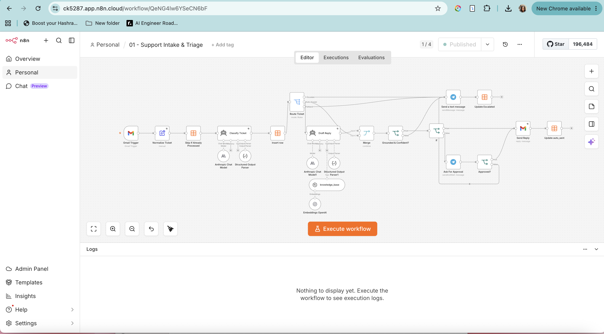
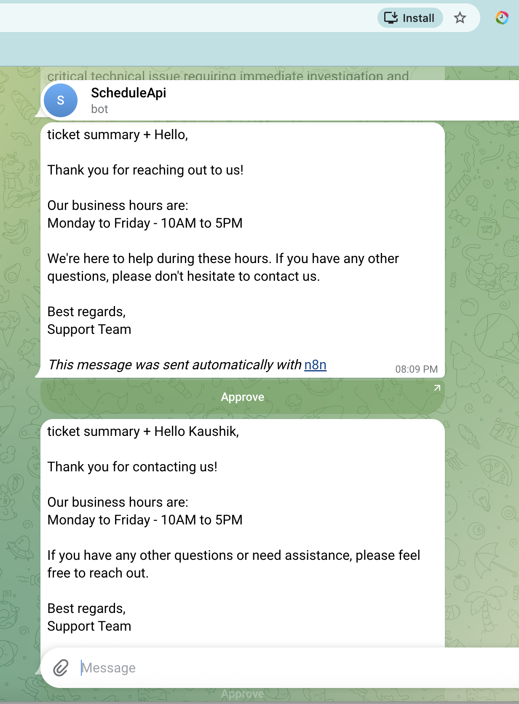
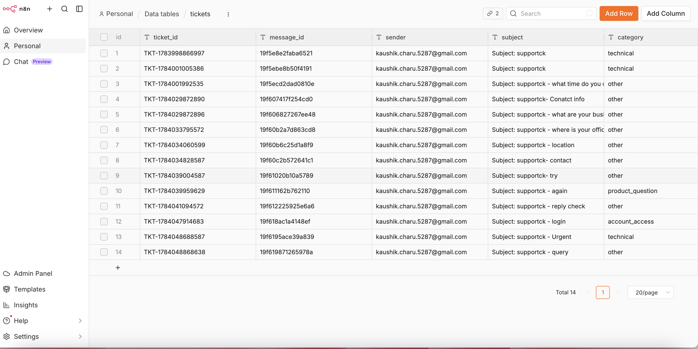
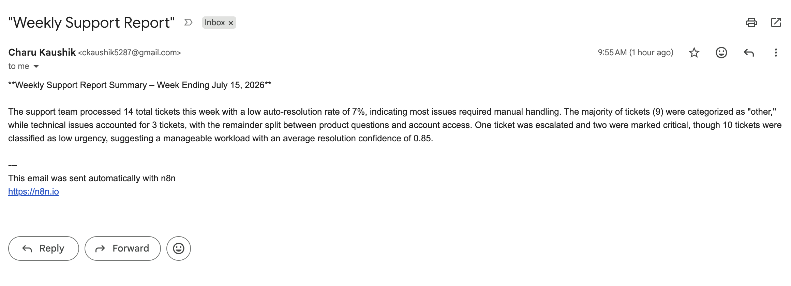

# AI Customer Support Automation System (n8n)

An end-to-end customer support automation built in **n8n**, combining LLM ticket triage, RAG-grounded auto-replies, human-in-the-loop approvals, and automated analytics — with production patterns like idempotent ingestion, confidence gating, centralized error handling, and retry policies.

**Result:** routine support emails are answered automatically within ~2 minutes, grounded strictly in a knowledge base (no hallucinated replies), while uncertain or urgent tickets are routed to a human with full context.



---

## Architecture

```
                        ┌─────────────────────────────────────────────┐
                        │        01 — Support Intake & Triage         │
                        └─────────────────────────────────────────────┘
Gmail Trigger ─► Normalize ─► Dedup check ─► LLM Classify ─► Log to DB ─► Route
                (clean fields)  (idempotent)  (structured JSON)            │
                                                            ┌─────────────┼──────────────┐
                                                            ▼             ▼              ▼
                                                        Escalate      Auto-Answer     Fallback
                                                            │             │              │
                                                       Telegram      RAG Draft Reply    │
                                                        alert        (KB vector store)  │
                                                            │             │              │
                                                            │      Grounded & confident? │
                                                            │        │yes        │no     │
                                                            │        ▼           ▼       │
                                                            │  confidence     Telegram ◄─┘
                                                            │  ≥ 0.85?        escalate
                                                            │   │yes  │no
                                                            │   ▼     ▼
                                                            │ Send  Telegram approval
                                                            │ reply (Send & Wait) ─► approved? ─► Send reply
                                                            ▼
                                                      Update ticket status in DB


02 — KB Ingestion:   Google Drive trigger ─► Download doc ─► Chunk (500/50 overlap)
                     ─► OpenAI embeddings ─► Vector store (memory key: support_kb)

03 — Weekly Report:  Schedule (Mon 9:00) ─► Fetch tickets ─► Filter last 7 days
                     ─► Aggregate (Code) ─► Claude executive summary ─► Email report

04 — Error Handler:  Error Trigger ─► Telegram alert (workflow name + error message)
                     (set as Error Workflow for 01 and 02)
```

---

## Key Features

**Three-tier response system.** Every AI-drafted reply carries a confidence score and a `grounded` flag from the LLM. High confidence (≥ 0.85) sends automatically; medium confidence pauses the execution and sends the draft to Telegram with one-tap Approve/Decline buttons (n8n *Send and Wait*); anything ungrounded, low-confidence, or critical-urgency escalates to a human. The AI is instructed to answer **only** from the knowledge base — if retrieval finds nothing, it must decline rather than invent an answer.

**RAG knowledge base.** Support docs live in a Google Drive folder. A trigger picks up new files, chunks them with a recursive character splitter (500 chars, 50 overlap), embeds them with `text-embedding-3-small`, and stores them in a vector store. The responder agent queries the store as a tool at answer time.

**Idempotent ingestion.** Every Gmail message ID is checked against the ticket database before processing — re-delivered or re-polled emails can never produce duplicate replies to a customer.

**Structured LLM outputs.** Both the classifier and the responder use structured output parsers (category, urgency, sentiment, answerable, confidence, reasoning / reply, grounded, confidence), so downstream routing logic always receives valid, typed JSON — never free text.

**Full ticket lifecycle tracking.** Every ticket row moves through statuses (`new → auto_sent / approved_sent / escalated`), giving an auditable record and powering the analytics.

**Operational hardening.** Centralized error workflow alerts via Telegram on any production failure; AI and email nodes retry on transient failures (3 attempts, 2s backoff); Telegram messages use HTML parse mode so user-generated content containing `_`, `*`, or `[` can't break delivery.

**Automated reporting.** A scheduled workflow aggregates the week's tickets (volume, category/urgency/status breakdowns, auto-resolution rate, average confidence) in a Code node, has Claude write a 3-sentence executive summary, and emails the report every Monday morning.

---

## Screenshots

| | |
|---|---|
|  |  |
| Main triage & response workflow | Human-in-the-loop approval with draft |
|  |  |
| Ticket database with lifecycle statuses | AI-summarized weekly report email |

---

## Tech Stack

- **n8n** (cloud) — orchestration, scheduling, human-in-the-loop, data tables
- **Anthropic Claude** — ticket classification and reply drafting (temperature 0.1, structured outputs)
- **OpenAI** `text-embedding-3-small` — embeddings for RAG retrieval
- **Gmail API** — ticket intake (polling trigger) and threaded replies
- **Google Drive API** — knowledge-base document ingestion
- **Telegram Bot API** — escalation alerts and approval buttons
- **n8n Data Tables** — ticket persistence and idempotency checks

---

## Ticket Database Schema

| Column | Type | Purpose |
|---|---|---|
| `ticket_id` | string | Generated ID (`TKT-<timestamp>`) |
| `message_id` | string | Gmail message ID — idempotency key |
| `sender`, `subject`, `body` | string | Normalized email fields |
| `category` | string | billing / technical / account_access / product_question / complaint / other |
| `urgency` | string | low / medium / high / critical |
| `sentiment` | string | positive / neutral / negative |
| `answerable` | boolean | LLM's judgment: answerable from docs alone? |
| `confidence` | number | 0–1 classification confidence |
| `status` | string | new → auto_sent / approved_sent / escalated |
| `created_at` | date | Ticket creation time |

---

## Setup

1. **Credentials** (n8n → Credentials): Gmail OAuth2, Google Drive OAuth2, Anthropic API, OpenAI API, Telegram Bot (create via @BotFather; get your chat ID from @userinfobot and message your bot once).
2. **Data table:** create `tickets` with the schema above (n8n → Data tables).
3. **Import workflows** from `workflows/` in order (01–04) and reattach your credentials to each node.
4. **Knowledge base:** create a `Support-KB` folder in Google Drive, add an FAQ doc, and run workflow 02 to build the vector store. *Note: the Simple Vector Store is in-memory — re-run ingestion after any n8n restart.*
5. **Error handling:** publish 04, then set it as the Error Workflow in the settings of 01 and 02.
6. Update the Telegram chat ID placeholders (`YOUR_CHAT_ID`) in workflows 01 and 04, adjust the Gmail trigger's search filter to your support address/label, and **publish**.

### Testing

Send yourself three emails matching the trigger filter:

- a question your FAQ answers → auto-reply arrives within the polling interval
- a question your FAQ *doesn't* cover → Telegram escalation (no invented answer)
- an "URGENT: site is down!" message → escalation with `critical` urgency

Then check the tickets table: every email logged once, statuses updated.

---

## Production Lessons Learned

Real issues hit and fixed during this build — the debugging matters as much as the happy path:

- **Fixed vs. Expression mode:** n8n parameter fields treat `{{ }}` as literal text unless the field is switched to Expression mode — the single most common silent misconfiguration.
- **Item pairing breaks after AI nodes:** `$('Node').item` reach-back references fail once an AI Agent replaces the item stream. Fixed with a **Merge (combine by position)** node to re-attach ticket data to AI output — batch-safe, no fragile reach-backs.
- **Telegram Markdown vs. real-world data:** default Markdown parse mode crashes on user content containing `_` (e.g. `account_access`). Switched to HTML parse mode.
- **Draft vs. published versions:** n8n serves the last *published* version in production; editor changes do nothing until published.
- **Prompt hardening:** the responder is instructed to return valid JSON even for empty/unreadable input, and the parser has auto-fix enabled — the model can never break the pipeline with prose.

---

## Roadmap

- Swap the in-memory vector store for **Pinecone** (persistent, upsert-based re-ingestion)
- Handle **File Updated** events with de-duplicated re-embedding of KB docs
- Multi-channel intake (webhook / Telegram / contact form) feeding the same triage pipeline
- Dashboard (n8n data table → charting) alongside the weekly email

---

*Built hands-on in n8n as a portfolio project, with AI-assisted development — every node configured, tested, and debugged manually.*
